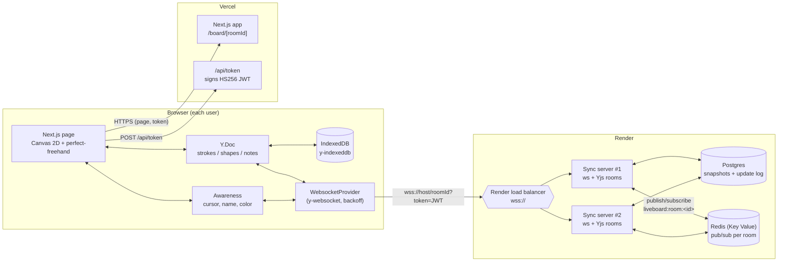
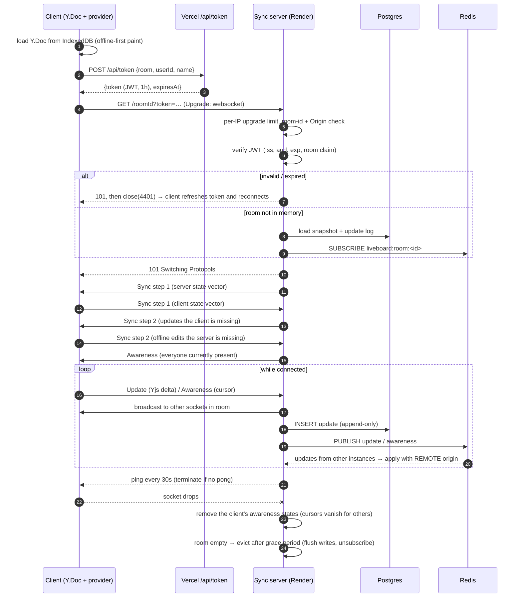

# LiveBoard — Project Setup

> Multiplayer real-time whiteboard: freehand drawing, shapes and sticky notes, live cursors and presence, offline editing that syncs when you reconnect.
> Owner: **Kei** ([@keix40](https://github.com/keix40)) · Size: large/complex · Deploy targets: **Vercel** (web) + **Render** (WebSocket sync server)

Starter code lives in the repo root (`apps/`, `packages/`). This document is the internal design and plan.

---

## Table of contents

1. [Tech stack](#a-tech-stack)
2. [Real-time WebSocket architecture](#b-real-time-websocket-architecture)
3. [Data model](#c-data-model)
4. [Folder structure](#d-folder-structure)
5. [Repo name, description, topics](#e-repo-name-description-topics)
6. [Milestone roadmap](#f-milestone-roadmap)

---

## (a) Tech stack

| Layer | Choice | Why (one line) |
|---|---|---|
| Monorepo | **pnpm workspaces + Turborepo** | One install and a shared `@liveboard/shared` types package; Turbo caches `build/typecheck/test` per package. |
| Language | **TypeScript (strict, ~5.9)** everywhere | Client and server share wire types and close codes, so protocol drift turns into a compile error. |
| Web app | **Next.js 16 (App Router) + React 19** | Easy to deploy on Vercel. Server route handlers mint room tokens and client components host the canvas. |
| Rendering | **Canvas 2D + [perfect-freehand](https://github.com/steveruizok/perfect-freehand)** | Pressure-sensitive, smooth strokes without a heavy scene-graph library. Konva can be added later for shape selection and transform handles. |
| Shared state | **[Yjs](https://yjs.dev) CRDT** | Conflict-free merges of concurrent edits, offline edits, and a proven binary sync protocol. |
| Transport | **y-websocket protocol** (`y-websocket` client, custom `ws` server) | The stock client already provides exponential-backoff reconnect and a sync handshake. A custom server lets us add auth, rate limits and persistence hooks. |
| Offline | **y-indexeddb** | The document is kept in IndexedDB, so the board loads and stays editable with no network. Yjs merges local edits on reconnect. |
| Presence | **Yjs awareness protocol** | Ephemeral cursor, name, color and tool state. It has built-in timeouts and is never persisted. |
| Sync server | **Node 22 + `ws`** on **Render** | Render runs it as a persistent process that holds long-lived sockets and keeps rooms in memory. [Hocuspocus](https://tiptap.dev/docs/hocuspocus) is a drop-in alternative if you'd rather use a framework. |
| Persistence | **Postgres** (Render Postgres) | An append-only update log plus snapshot compaction. Durable, and easy to inspect. |
| Fan-out | **Redis pub/sub** (Render Key Value) | Relays updates and awareness between server instances when one room's users land on different instances. |
| Auth | **Short-lived HS256 JWT** (`jose`) | Vercel signs the token and Render verifies it with the same secret, so no session lookup is needed on the hot path. |
| Testing | **Vitest** (unit and server integration) + **Playwright** (two-browser e2e) | Fast, TypeScript-native tests. Playwright can drive two browser contexts in one room. |
| CI | **GitHub Actions** | Runs `pnpm typecheck && pnpm test && pnpm build` on every push and PR. |

### Why the sync server is on Render and not Vercel

For a long time, Vercel Functions could not act as a WebSocket server at all. In **June 2026 Vercel shipped WebSocket support for Functions as a public beta** ([changelog](https://vercel.com/changelog/websocket-support-is-now-in-public-beta), [docs](https://vercel.com/docs/functions/websockets)). The beta's constraints still conflict with a CRDT room server:

- **Connections close when the function reaches its maximum duration.** Every client would be forced to reconnect every few minutes, and each reconnect costs a full sync handshake.
- **Connections are pinned to one instance, and new connections aren't guaranteed to reach the same one.** Vercel's docs say to keep rooms, presence and pub/sub in an external store rather than in memory. A Yjs server gets its speed from keeping each room's `Y.Doc` hot in memory and fanning out from there.
- **Billing and lifecycle are built around invocations.** A whiteboard room can sit open for hours, and a persistent process is the simpler, more predictable fit.
- **Next.js has no first-class upgrade API.** It would need `experimental_upgradeWebSocket()`.

So: **Next.js on Vercel** serves the UI and the `/api/token` endpoint, and a **long-lived Node process on Render** holds the sockets. Render web services support WebSockets natively. Use a paid instance, because free instances spin down when idle and that drops every socket.

---

## (b) Real-time WebSocket architecture

### Component diagram



### Connection lifecycle



### Message types (y-websocket wire protocol, binary, `lib0` varint encoding)

Each frame starts with a `varUint messageType`.

| Type | Id | Payload | Direction | Purpose |
|---|---|---|---|---|
| **Sync / step 1** | `0` then `0` | state vector | both | "Here's what I have. Send me what I'm missing." |
| **Sync / step 2** | `0` then `1` | Yjs update (diff) | both | Reply to step 1 with the missing operations. |
| **Sync / update** | `0` then `2` | Yjs update | both | Incremental live edit (a stroke point, a moved note, …). |
| **Awareness** | `1` | awareness update (clientID → JSON state + clock) | both | Cursors, names, colors, tools. A `null` state means the user left. |
| **Auth** | `2` | permission-denied reason | server → client | Part of the protocol. LiveBoard authenticates during the upgrade instead and ignores in-band auth frames. |
| **Query awareness** | `3` | none | client → server | Asks the server for the full presence list. |

Close codes (app-private range) are defined in `packages/shared` → `CloseCode`: `4401` unauthorized (refresh the token and retry), `4403` forbidden for this room, `4408` rate limited, `4429` room full, `1001` server restarting (reconnect normally), `1013` try again. The `y-websocket` client treats `4400–4499` as terminal and emits `closed`. Our `room-connection.ts` reacts to each code.

### Room model

- **Room = one `Y.Doc` + one `Awareness` + the set of sockets on this instance.** The room id is taken from the URL path (`wss://host/<roomId>`) and must match `^[a-zA-Z0-9_-]{3,64}$`.
- `RoomManager` loads rooms lazily and de-duplicates concurrent loads by caching the load `Promise`.
- The server's own awareness state is `null`. Each socket tracks the awareness clientIDs it controls, so they can be removed on disconnect.
- **Eviction:** when a room's last socket leaves, a timer starts (`ROOM_IDLE_MS`, 30 s by default). When it fires, the server flushes pending writes, re-checks that the room is still empty, then unsubscribes and destroys the doc. A client that rejoins during the grace period reuses the hot room.
- **Roles:** `editor` can send updates. `viewer` may only send sync step 1, so its updates are dropped server-side.

### Reconnect and backoff

| Situation | Behaviour |
|---|---|
| Network blip, server deploy (1001), 1006, 1013 | y-websocket retries with exponential backoff, `100ms × 2^n` capped at `maxBackoffTime` (10 s in LiveBoard). It resyncs through step 1/2, so nothing is lost. |
| Browser fires `online` | Reconnect immediately instead of waiting out the backoff. |
| `4401` (token expired or invalid) | Fetch a fresh token from `/api/token`, set `provider.params.token`, call `connect()`. |
| Token near expiry | Refresh 60 s before `exp`. The new token is used on the next reconnect, and live sockets are unaffected. |
| `4408` rate limited | Wait 5 s, then reconnect. |
| `4403`, `4429` | Terminal. Show "Access denied" or "Room is full". |
| Half-open TCP (laptop lid closed) | The server pings every 30 s and terminates sockets that don't answer. The client has its own watchdog: y-websocket closes the socket if no message arrives for 30 s, and awareness renewals keep traffic flowing. |

### Offline

- `y-indexeddb` keeps the full doc locally, keyed by `liveboard:<roomId>`. The provider connects **after** IndexedDB has loaded, so the local board appears immediately.
- Offline edits are ordinary Yjs transactions. On reconnect, the sync step 1/2 exchange sends only the missing operations in each direction, and CRDT semantics make the merge deterministic, with no conflict dialogs.
- Presence is deliberately *not* offline: while disconnected, remote cursors are cleared.

### Persistence strategy (snapshot + update-log compaction)

```
liveboard_updates   (id BIGSERIAL, room_id, update BYTEA, created_at)   ← every client update, append-only
liveboard_documents (room_id PK, snapshot BYTEA, compacted_at)          ← folded state
```

1. **Write path:** every doc update whose origin is a *local client* is `INSERT`ed into `liveboard_updates`. Updates from persistence or Redis are not re-written. Inserts are cheap and never lose data.
2. **Load path:** `snapshot` plus all `update` rows `ORDER BY id` are applied to a fresh `Y.Doc` and encoded as one update. Going through a doc lets Yjs garbage-collect deleted content.
3. **Compaction:** after `COMPACT_EVERY_N_UPDATES` local updates (500 by default), the server runs one transaction guarded by `pg_try_advisory_xact_lock(hashtext(room_id))`. It reads the snapshot and log, folds them, upserts the snapshot, and deletes only the rows it folded (`id <= maxId`). Compaction is computed **from stored data, not from one instance's memory**, so it's safe with multiple instances writing the same room.
4. **Shutdown:** on `SIGTERM` (which Render sends during deploys), the server closes sockets with `1001`, waits for pending writes, and closes the pool.
5. *Later:* periodic cold-room compaction job (Render cron) and optional TTL for abandoned boards.

`MemoryPersistence` implements the same interface for local dev and tests.

### Scaling across multiple instances (Redis pub/sub)

- Render's load balancer doesn't route by room, so two users in the same room can land on **different instances**.
- Each instance subscribes to `liveboard:room:<roomId>` while that room is loaded. When a local client sends an update or awareness change, the instance **publishes** it (binary frame: `originInstanceId | kind | payload`). Other instances apply it with `REMOTE_ORIGIN` and broadcast it to their own sockets. They don't persist or re-publish it, which prevents loops.
- **Durability comes from Postgres; Redis is only for fan-out.** A newly loaded room reads Postgres, and Yjs step 1/2 fills any gap with the clients.
- Known gap (documented in the roadmap): an update published *before* another instance subscribed and *not yet* inserted is only reconciled when a client that has it resyncs. y-websocket can resync periodically (`resyncInterval`). A future improvement is to broadcast a state vector on subscribe.
- Later option: **room-affinity routing** (consistent hashing on room id in front of the instances) to reduce cross-instance traffic.

### Auth handshake

1. The browser calls `POST /api/token` on Vercel with `{room, userId, name}`. In guest mode the route issues an editor token. In production it should check a real session and the board ACL.
2. The token is an HS256 JWT with `iss=liveboard-web`, `aud=liveboard-sync`, `sub`, `name`, `room` (or `*`), `role` and `exp` (1 h). It's signed with `LIVEBOARD_JWT_SECRET`, which is shared with Render.
3. The browser opens `wss://sync/<roomId>?token=<jwt>`. Browsers can't set headers on WebSocket requests, and the query parameter is what y-websocket's `params` supports. Tokens are short-lived, and query strings shouldn't be logged.
4. The server verifies the token during the HTTP upgrade *before* joining a room. Failures are reported as close code `4401/4403` after the upgrade, because browsers hide handshake HTTP status codes.
5. `ALLOWED_ORIGINS` rejects cross-site upgrades (a CSRF-style WebSocket attack) with a 403.

### Rate limiting and abuse protection

| Control | Where | Default |
|---|---|---|
| Upgrade attempts per IP (uses `X-Forwarded-For` first hop) | HTTP upgrade | 60 / minute → 429 |
| Messages per socket (token bucket) | per connection | 60 msg/s sustained, burst 200 → close `4408` |
| Max frame size | `ws` `maxPayload` | 1 MiB → close `1009` |
| Max sockets per room | upgrade | 50 → close `4429` |
| Slow consumer | send path | `bufferedAmount > 8 MiB` → terminate |
| Text frames or unknown message types | message handler | close `1008` |
| Heartbeat | server | ping every 30 s, terminate on missed pong |

---

## (c) Data model

### Yjs document (the source of truth for board content)

```
Y.Doc (room)
├── strokes : Y.Array<Y.Map>            order = z-order of freehand ink
│     └── { id, authorId, color, size, createdAt,
│           points: Y.Array<number> }   flat [x, y, pressure, x, y, pressure, …]  (streams while drawing)
├── shapes  : Y.Map<id, Y.Map>          (planned)
│     └── { id, kind: rect|ellipse|line|arrow, x, y, w, h, rotation,
│           stroke, fill, strokeWidth, z, authorId, createdAt }
├── notes   : Y.Map<id, Y.Map>          (planned)
│     └── { id, x, y, w, h, color, text: Y.Text, z, authorId, createdAt }
└── meta    : Y.Map                     { title, createdAt, schemaVersion }
```

Design notes:
- Strokes live in a **Y.Array** because append order is z-order and an eraser deletes by index. Shapes and notes live in a **Y.Map keyed by id** because they're moved and edited in place, and a map avoids index shifting under concurrent inserts. Their z-order is a fractional `z` field.
- `points` is a nested `Y.Array<number>`, so remote users see a stroke **while** it's being drawn instead of when the pen lifts.
- Note text is a `Y.Text`, so two people typing in one sticky note merge character by character.
- Coordinates are in board space. Today board space equals screen pixels; the pan/zoom milestone adds a camera transform.
- Undo and redo use `Y.UndoManager` scoped to `LOCAL_ORIGIN`, so you can only undo **your own** changes.

### Awareness state (ephemeral, per connection)

```ts
{ user: { id, name, color }, cursor: { x, y } | null, tool?: "pen"|"eraser"|…, selection?: string[] }
```

### JWT claims

```ts
{ sub: userId, name, room: roomId | "*", role: "editor" | "viewer", iss: "liveboard-web", aud: "liveboard-sync", iat, exp }
```

### Postgres (sync server)

```sql
liveboard_documents(room_id TEXT PK, snapshot BYTEA NOT NULL, compacted_at TIMESTAMPTZ)
liveboard_updates  (id BIGSERIAL PK, room_id TEXT NOT NULL, update BYTEA NOT NULL, created_at TIMESTAMPTZ)
  INDEX (room_id, id)
```

### Planned (auth milestone, web-side database)

```sql
users(id UUID PK, email UNIQUE, name, avatar_url, created_at)
boards(id TEXT PK /* = room_id */, owner_id → users, title, visibility: private|link|public, created_at)
board_members(board_id → boards, user_id → users, role: owner|editor|viewer, PRIMARY KEY(board_id, user_id))
share_links(token TEXT PK, board_id → boards, role, expires_at)
```

---

## (d) Folder structure

```
liveboard/
├── .github/workflows/ci.yml        # typecheck + test + build on push/PR
├── docs/DESIGN.md                  # this design doc (copy of SETUP.md)
├── apps/
│   ├── server/                     # WebSocket sync server (Render)
│   │   ├── render.yaml             # Render Blueprint: web service + Postgres + Key Value
│   │   ├── scripts/mint-token.ts   # dev helper: print a room JWT
│   │   ├── sql/001_init.sql        # schema (also auto-applied on boot)
│   │   ├── src/
│   │   │   ├── index.ts            # entry: config, listen, graceful SIGTERM
│   │   │   ├── server.ts           # HTTP (/healthz) + upgrade: limits, origin, JWT, room join, heartbeat
│   │   │   ├── room.ts             # Y.Doc + awareness + sockets; sync protocol; fan-out; compaction trigger
│   │   │   ├── room-manager.ts     # lazy load, de-dupe, idle eviction, shutdown
│   │   │   ├── protocol.ts         # y-websocket frame encoders
│   │   │   ├── auth.ts             # jose verify/sign
│   │   │   ├── rate-limit.ts       # token bucket + per-IP window
│   │   │   ├── config.ts / logger.ts
│   │   │   ├── persistence/        # DocPersistence: memory, postgres (+ fold/merge)
│   │   │   └── pubsub/             # PubSub: local (no-op), redis
│   │   ├── test/sync.test.ts       # real server + y-websocket clients (Vitest)
│   │   └── package.json, tsconfig*.json, vitest.config.ts
│   └── web/                        # Next.js app (Vercel)
│       ├── app/
│       │   ├── page.tsx            # landing: create / join room
│       │   ├── board/[roomId]/page.tsx
│       │   ├── api/token/route.ts  # mints room JWTs
│       │   ├── layout.tsx, globals.css
│       ├── components/             # Whiteboard (canvas + input), Toolbar, Cursors
│       ├── lib/                    # room-connection (provider + IndexedDB + reconnect), useRoom, strokes, identity
│       ├── e2e/multiplayer.spec.ts # Playwright: two browsers, one room
│       └── next.config.mjs, vercel.json, playwright.config.ts, vitest.config.ts, package.json, tsconfig.json
├── packages/
│   └── shared/src/index.ts         # doc keys, message types, close codes, board/awareness/JWT types
├── .env.example
├── package.json, pnpm-workspace.yaml, pnpm-lock.yaml, turbo.json, tsconfig.base.json
├── LICENSE (MIT)
└── README.md
```

---

## (e) Repo name, description, topics

- **Repo name:** `liveboard` (→ `github.com/keix40/liveboard`)
- **Description:** "Multiplayer real-time whiteboard: Yjs CRDT sync over WebSockets, live cursors & presence, offline-first. Next.js on Vercel + Node sync server on Render."
- **Topics:** `whiteboard` `realtime` `collaboration` `crdt` `yjs` `websocket` `multiplayer` `offline-first` `nextjs` `typescript` `canvas` `turborepo` `postgresql` `redis` `vercel` `render`

---

## (f) Milestone roadmap

| # | Milestone | Scope | Done when |
|---|---|---|---|
| **M0** | Scaffold ✅ *(starter)* | Monorepo, shared types, CI, env, Render Blueprint | `pnpm typecheck && pnpm test` passes in CI |
| **M1** | Freehand + presence ✅ *(starter)* | Canvas 2D strokes in `Y.Array`, live cursors, presence avatars, undo/redo, eraser, reconnect, IndexedDB offline | Two browsers draw together, with cursors; the Playwright spec passes |
| **M2** | Durable rooms on Render | Postgres persistence live, compaction verified, `/healthz` wired to the Render health check, graceful deploys | A room survives a deploy/restart; the update log stays bounded |
| **M3** | Shapes & sticky notes | `shapes`/`notes` maps, selection, move/resize/rotate handles (consider Konva for hit-testing), `Y.Text` note editing, remote selection outlines | Concurrent edits of one note merge correctly (unit test) |
| **M4** | Infinite canvas | Pan/zoom camera, board↔screen transforms for strokes and cursors, viewport culling, minimap | Smooth interaction on a board with many strokes (measure it with the Performance panel, don't guess) |
| **M5** | Real auth & sharing | Auth provider (e.g. Auth.js/Clerk), boards + members tables, viewer/editor share links, `/api/token` checks the ACL | Viewer links cannot modify the board (server test already covers role enforcement) |
| **M6** | Horizontal scale | Redis pub/sub on ≥2 Render instances, resync-on-subscribe, optional room-affinity routing, load-test script (k6 or artillery) | Two users on different instances stay in sync; publish your own measured numbers |
| **M7** | Polish & portfolio | Export PNG/SVG, dark mode, mobile/pen support, a11y pass, OpenTelemetry/metrics, demo GIF and screenshots, blog post on the sync design | README demo section filled with real media |

### Risks and mitigations

- **Doc growth:** Yjs keeps tombstones. Mitigate with gc-enabled docs, compaction through a fresh doc, and point sampling (`streamline`) plus a per-stroke point cap.
- **Malicious updates:** clients can send arbitrary valid Yjs ops, such as a huge stroke or garbage keys. Mitigate with frame size limits and rate limits, then add server-side schema validation of updates in M5.
- **Awareness spoofing:** a client can set any name or color. Later, the server can overwrite `user` fields from JWT claims.
- **Cold starts:** a Render free instance spins down when idle. Use a paid instance for the demo, or accept the first-connect delay and say so in the README.
